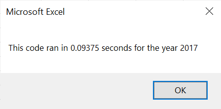
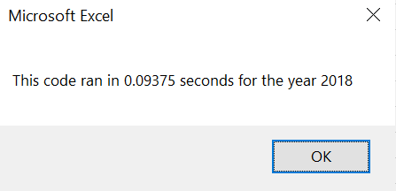

# stocks-analysis

## Overview

In this project, we have refactored Steve's workbook that had analyzed a dozen stocks from 2017 and 2018. We have done this as he wants to expand the dataset to include the entire stock market. However if we used the same code from before, it would have either not worked as well or might have taken too long to execute. By modifying our code, we are trying to reduce the elapsed run time it takes to calculate the return for Steve to have the ability to analyse the rest of the excel. 

## Results

Based on our results from the 12 stocks, in 2017 there was a positive return in all except for "TERP". However, in 2018 there was a negative return for all except for "ENPH" and "RUN". It seems as if 2018 was a bad year to invest however the negative return probably had a small effect if Steve had invested in 2017. This is because the percentages of positive return are much higher than the losses of the next year. For example, "DQ" had a percentage return of 199.4% in 2017 but loss 62.6% the next year. This still amounts to a total postive return of 136.8% which is still high. In terms of our refactoring, as you can see below, we were able to decrease the elapsed time of the analysis for both years. This time decreased by almost a 1 second which is significant for when Steve wants to expand the dataset.

 

## Summary

Given our results in having a quicker elapsed run time for both years, there are many advantages when refactoring code. Refactoring is a key part to making our code more efficient. This is all due to it taking less steps, using less memory, and improving the logic of the code for future users. However, it can also bring more issues such as potential bugs. As well, even though refactoring can decreased the elapsed time, it does not change the results of the analyis. 

When it comes to refactoring the original VBA script, the positives do outweight the negatives. This is because Steve wants to analyze the entire stock market over the last few years and without reducing the time it takes to complete the analysis, it could possibly not work or take too long to execute. This is important to Steve as he loves the workbooks simple and quick results of the dataset. However, without the guidance of the first deliverable, it could be difficult and time consuming to identify and test what code would make this process faster. 
